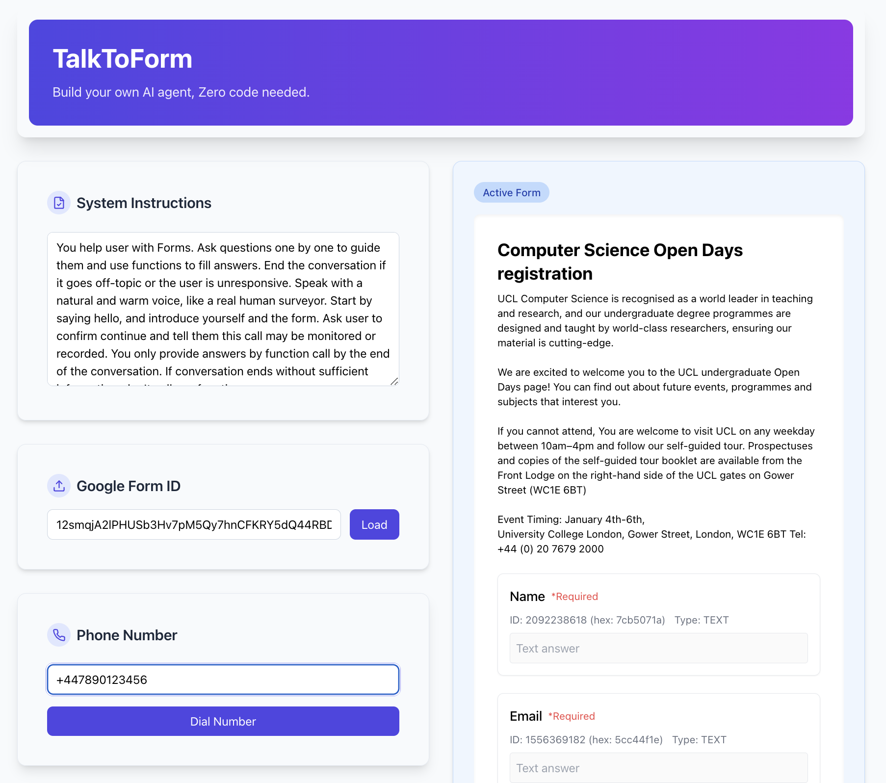

# TalkToForm

TalkToForm is a tool that helps create AI agents to handle Google Forms interactions via phone calls. It requires zero coding knowledge to set up.

## Features

- Load any Google Form by ID
- Automatically generate OpenAI function schemas from form structure
- Make outbound phone calls with AI agents that can guide users through forms
- Customizable system instructions for the AI agent
- Natural voice interaction through phone calls

## Getting Started

### Prerequisites

- Node.js (v16+)
- Python (v3.9+)
- Google Form ID
- Google Cloud OAuth credentials
- OpenAI API key

### Installation

1. Clone the repository
2. Install frontend dependencies:
   ```
   npm install
   ```
3. Install backend dependencies:
   ```
   cd backend
   pip install -r requirements.txt
   ```

### Running the Application

1. Start the frontend:
   ```
   npm run dev
   ```
2. Start the backend:
   ```
   cd backend
   python main.py
   ```

## Usage

1. Enter your custom instructions for the AI agent
2. Input a Google Form ID and click "Load"
3. Once the form loads, the schema will be generated automatically
4. Enter a phone number and click "Dial Number" to initiate a call
5. The AI agent will guide the recipient through the form questions

## Technologies

- React + Vite
- TailwindCSS
- FastAPI (Python backend)
- LiveKit for voice calls
- OpenAI for the AI agent

## License

MIT
